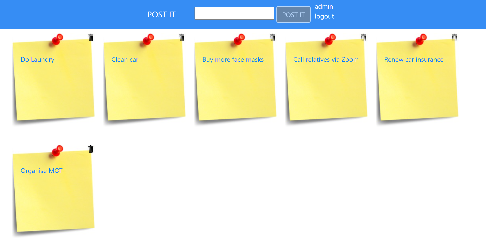

# What is the "postit" application
It is an application to help people manage their postit notes.

An authenticated user can:
- Create
- Read
- Update
- Delete

postit notes. A user can only perform CRUD operations on their own notes.

# How is the "postit" application structured:
- a frontend which is written in Angular. 
- a backend which is written in Java with SpringBoot

# How do I run the application?
1. Start the backend
  - Open a terminal
  - run `cd backend`
  - run `mvn -U clean install`
  - run `mvn spring-boot:run`
2. Start the frontend
  - Open a terminal
  - run `cd frontend`
  - run `npm install`
  - run `ng serve`
  
Both the frontend and the backend should be running. Now navigate to http://localhost:4200. You can use the following credentials:
- username: `admin`
- password: `password`

Things to do:
- JMeter performance test
- infinate scroll
- OAuth authentication
- Keyboard shortcuts
- Spring Batch: Write a spring boot app that utilizes Spring Batch to migrate notes from a text file into the datastore
- AWS Beanstalk
- Multi-tenanted
- i18n

# Code coverage metrics
You can find the code coverage metrics for the backend in:
target\site\jacoco\index.html
